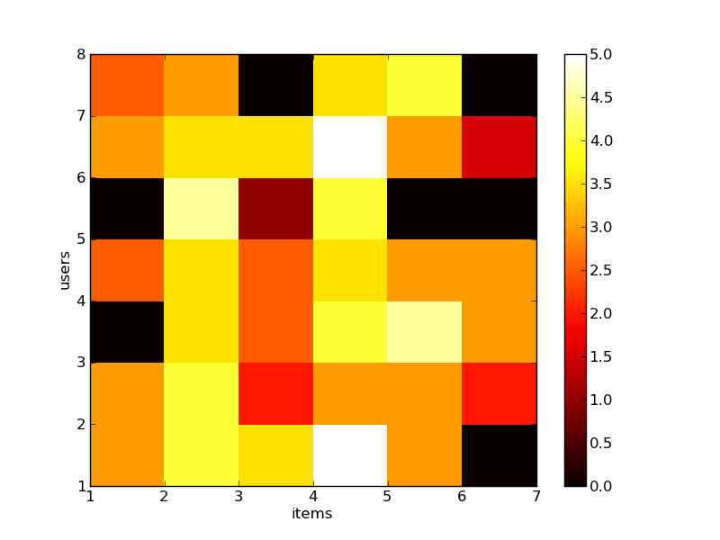

.. _getting_started:
=======================================================================
Getting started: an introduction to recommender systems with Crab
=======================================================================

.. topic:: Section contents

    In this section, we introduce the idea of a recommender engine that we use through 'Crab`
    and give a simple recommender example.

Introducing Recommendation Engines
==================================

Everyday we form opinions about things we like, don't like and even don't care about. For example,
when you watch a television show, you either notice it because it's a funny show, or because
it is boring or maybe don't notice it at all. It happens without we noticing and with food,
movies, songs, hairstyles, ski resorts and so on.

Our tastes vary, but we generally follow patterns. People tend to like things that are similar
to other things they like. Because I love the  Matrix film, you can guess I would like to 
watch Minority Report, which is mostly the same genre, action and sci-fi. Likewise, people
also tend to like things that similar people like. Just consider a design student that
entered the design school, when he sees just every other design student using a Macintosh computer,
he isn't surprised, since he was already a lifetime Mac user. Recommendation is all about 
predicting these likes and dislikes, and using them to discover new and desirable things
you didn't already know about.

What is recommendation ?
-------------------------

In this tutorial, we will explore some of the ways people make recommendations and discover 
new things -- and of course learn how those systems work in software with Crab. There are
several strategies for creating recommendations: One could look to what people with similar
tastes seem to like. Another approach would figure out what items are like the ones we 
already like. Those strategies describe the two most well-known categories of recommender
techniques: `user-based` and `item-based` recommenders and they are included in a major
category called `Collaborative Filtering`. Before exploring them, let's explain the
differences  between this type of filtering and the `Content-Based Filtering`, 
another popular large recommendation category.

 
Collaborative Filtering and Content-Based Filtering
---------------------------------------------------

The scenarios above presented are examples of `Collaborative Filtering`, which produces 
recommendations based on the knowledge of users' relationships to items. In this category
there is no requirement for knowledge of the properties or attributes of the items
themselves. This recommender framework does not care whether the `items` are books,
movies, flowers, or even people, since nothing about their attributes enters into any
of the input.

Approaches focusing on the attributes of items are usually referred to as `content-based`
filtering recommendation techniques. For instance, consider a book recommender system,
which recommends you Programming the Collective Intelligence because you love Artificial
Intelligence books (you already read several books about A.I. and the system knows your
historical records). It is clear that the recommendation is based on an attribute of the
books: the main category. This is something more like content-based recommendation.

The Crab recommender framework does not yet implement these techniques, but is planned
to be implemented in future releases. This tutorial will focus on `collaborative filtering`.

Recommendation hit the mainstream
---------------------------------

Recommendations are quite popular. We have seen them in practice on sites such as 
Amazon or Last.FM: based on browsing or historical records. The main goal is to
produce a list of products that it believes may be interesting for you. These techniques has been
a topic of research in machine learning since 1990's and has becoming more mainstream,
demand for them has increased, and supply of open-source implementations has as well. 
This, along with increasingly accessible and cost-effective computing power, means that
recommender engines are becoming more accessible and widely used.

Recommendation engines can also be applied to estimate the strength of associations between
many things or even estimate which customer might like a certain item the most. 
Even in a social network, a recommender could recommend friends to people.

Running a first recommender engine
----------------------------------

`Crab` contains several recommender algorithms implemented, in fact, starting with conventional
user-based and item-based recommenders. There is also a experimental implementation based on
the singular value decomposition (SVD). In the upcoming sections, you will find detailed
information about those techniques and some real-world examples. Now we will give a quick start
at how to represent data, build a recommender engine and evaluate the effectiveness of the 
recommendations.

.. topic:: Creating the input

	To explore recommendations in Crab, we need input the recommender, data on which
	to base recommendations. This takes the form of `preferences` in Crab. Because
	the recommender engines that are most familiar involve recommending items to users,
	it will be convenient to talk about preferences as associations from users to items 
	(which both could be anything).
	Generally a preference consists of an user ID and an item ID, and usually a number 
	expressing the strength of the user's preference for the items. The preference value
	could be anything. Generally larger values mean stronger positive preferences. 
	So if those values are ratings on a scale 1 to 5, the `1` could mean items that the
	user can't stand, and `5` as favorite items.

`Crab` comes with a few standard datasets, for instance the `songs dataset`, or
the `movies dataset`::

	    >>> from scikits.crab import datasets
	    >>> movies = datasets.load_sample_movies()
	    >>> songs = datasets.load_sample_songs()

A dataset is a dictionary-like object that holds all the data and some metadata about the 
data. This data is stored in the `.data` member, which is a dictionary in the format
{user_id:{item_id: preference, item_id2: preference, ...}, user_id2: {...}, ...}. 
More details on	the different datasets can be found in the :ref:`dedicated section <datasets>`.

For instance, in the case of the movies dataset, `movies.data` gives access to the users,
cleverly named `1` to `7, and their preferences for the movies, which we will call `1`
through `6``. In real-life, these might be customer IDs and product IDs from a company
database::

	    >>> print movies.data
		{1: {1: 3.0, 2: 4.0, 3: 3.5, 4: 5.0, 5: 3.0},
		 2: {1: 3.0, 2: 4.0, 3: 2.0, 4: 3.0, 5: 3.0, 6: 2.0},
		 3: {2: 3.5, 3: 2.5, 4: 4.0, 5: 4.5, 6: 3.0},
		 4: {1: 2.5, 2: 3.5, 3: 2.5, 4: 3.5, 5: 3.0, 6: 3.0},
		 5: {2: 4.5, 3: 1.0, 4: 4.0},
		 6: {1: 3.0, 2: 3.5, 3: 3.5, 4: 5.0, 5: 3.0, 6: 1.5},
		 7: {1: 2.5, 2: 3.0, 4: 3.5, 5: 4.0}}

and `movies.item_ids` \ `movies.user_ids gives the ground truth for the movies dataset, 
that is the real user ids and real item ids in case of presenting the recommendations
in the console::

	>>> print movies.user_ids
	{1: 'Jack Matthews',
	 2: 'Mick LaSalle',
	 3: 'Claudia Puig',
	 4: 'Lisa Rose',
	 5: 'Toby',
	 6: 'Gene Seymour',
	 7: 'Michael Phillips'}
	>>>
	>>> print movies.item_ids
	{1: 'Lady in the Water',
	 2: 'Snakes on a Planet',
	 3: 'You, Me and Dupree',
	 4: 'Superman Returns',
	 5: 'The Night Listener',
	 6: 'Just My Luck'}

With some study, we notice some trends. Users 1 and 2 seem to have similar tastes. 
They both like movie 4, like 2 a little less, and like 1 less still. The same 
goes for users 1 and 4, as they seem to like 2 and 4 identically. On the other
hand, users 1 and 7 have tastes that seem to run counter – 1 likes 1 while 7
doesn't, and 1 likes 3 while 4 is just the opposite. See figure below 
to visualize the relations, both positive and negative between users and items.
The heat map shows more heat to higher ratings against the lower ratings given by
the users to the movies.

``Crab`` also offers the possibility to use external datasets coming
from simple comma-separated-value format files (.csv).

Building a Recommender System
-----------------------------
Our goal now is to recommend a movie to Toby (user 5). You already can notice that the 
movies Snakes on a Planet (item 2), You, Me and Dupree (item 3) and Superman Returns (item 4) - 
he already watched these movies, and recommendation is typically about discovering new things. On
intuition we would suggest the movie 5, movie 1 or movie 6 because Toby seems similar to Lisa Rose (user 4) 
and Mick LaSalle (user 2). So we have now items 1, 5 and 6 as possible recommendations. On the whole,
item 6 seems to be the most liked of these possibilities, judging by the preference values 
of 3.0  for both similar users. Let's go to the code:

	>>> from scikits.crab.models import MatrixPreferenceDataModel
	>>> #Build the model
	>>> model = MatrixPreferenceDataModel(movies.data)
	>>> 
	>>> from scikits.crab.metrics import pearson_correlation
	>>> from scikits.crab.similarities import UserSimilarity
	>>> #Build the similarity
	>>> similarity = UserSimilarity(model, pearson_correlation)
	>>>
	>>> from crab.recommenders.knn import UserBasedRecommender
	>>> #Build the User based recommender
	>>> recommender = UserBasedRecommender(model, similarity, with_preference=True)
	>>> #Recommend 1 item for the user 5 (Toby)
	>>> recommender.recommend(user_id=5, how_many=1)
	[(5, 3.3477895267131013)]

We will discuss each of these components in our recommender in details in the next sections, but
we can summarize the role of each component now. The `MatrixPreferenceDataModel` implementation
stores and provides access to all the user and item data as also the associated preferences
needed in the computation. The `UserSimilarity` defines the notion of how similar two users are;
this is based on one of many possible metrics or pairwise distance calculations. A `NearestNeighborhood` implementation
defines the notion of a group of users that are most similar to a given user. At least, the `UserBasedRecommender`
implementation pulls all these components together in order to recommend
items to users, and related features. To help visualize the relationship between the components,
check the figure below. Of course there is more going under Crab-based recommenders, since
some will employ different components with different relationships. However, this diagram will give
you a global notion of what's going on in our example.

.. figure:: images/crab_arch.png
   :scale: 80%
   :align: center

Analyzing the output
--------------------
If you save the code provided above in a python file (.py) and run it at  your terminal, the output
should be: 	[(5, 3.3477895267131013), (1, 2.8572508984333034), (6, 2.4473604699719846)]. We requested 
for the top recommendation, and the recommender engine gave us one. He recommended the movie 
Just My Luck to Toby. Furthermore, it also informed the estimated Toby's preference
for the movie Just My Luck, which is about 4.3, and that was the highest among all the items eligible
for recommendations. It isn't bad. We didn't get the movie, which was a possible item and we picked the 
item 4 over 5, and this makes sense when you note that 4 is a more highly rated overall. The estimated
preference reflects how much Toby likes the movie Just My Luck with a rating 4.34 which between 
the users C e D expressed.

Of course analyzing the data isn't so obvious even considering that the recommender engine made
some decent sense and it returned an interesting answer. For small data sets like those, producing
recommendations is a trivial as I described above. But in real life the data sets are huge and they
are noisy. Producing the right recommendations for this type of data and producing quickly 
is not even trivial. Later in the next sections it will presented the tools that Crab provides  to 
attack these problems. We will show how to configure and customize Crab to improve performance and how
the standard approaches may produce poor recommendations or demanding a great deal of CPU and memory.

Evaluating a Recommender
------------------------
A recommender engine is a tool to produce the best recommendations for a for user. But how can we 
define exactly what is a good recommendation ? And how will we know that the recommender is producing them ?
We know that a best possible recommender would be an engine that would predict exactly how much we 
would like every possible item that we've not expressed any preference for and rank them based
on these future preferences. In fact, most recommender engines operate by trying to do this, estimating
ratings for some or all other items. To evaluate the quality of those recommendations we will need
tools and metrics that focus on how closely the estimated preferences match the actual preferences.

Training and Testing Data
-------------------------
Those "actual preferences" don't exist though because nobody knows for sure how they will like some new 
items in the future. This can be simulated to a recommender engine by setting aside a small part of 
the real data set as test data. These test preferences are not present in the training data (which
is all data except the test data.) The recommender is asked to estimate preference for the missing
test data, and estimates are compared to the actual values. There are several metrics to generate a
"score" for the recommender. For example, the root-mean-square (RMSE): it is the square root
of the average of the squares of the differences between actual and estimated preference values.
0.0 would mean perfect estimation - no difference at all between estimates and actual values.

Running a Recommender Evaluator
-------------------------------
Let's go back to the recommender we created, and evaluate it on our simple dataset:

Most of the action happens in evaluate(). Inside, the CFEvaluator handles splitting the data into a training and test set,
builds a new training DataModel and a Recommender to test, and compares its estimated preferences to the actual test data.

Check the Result
----------------
The evaluator shows the result of the evaluation:  a score indicating how well the recommender performed. In this example
you will see : 1.0. What this value means depends on the metric we used - here, Root Mean Squared Error (RMSE). A result 
of 0.0 from this metric means that, on average, the recommender estimates perfectly the preferences compared to the actual
preferences.

Evaluating Precision and Recall
-------------------------------
There are also other metrics from classic retrieval information measures to evaluate recommenders: precision and recall. 
These metrics are typically applied to search engine and return some set of best results for a query out of many 
possible results. In fact, generally we want is an ordered list of recommendations, from best to worst without caring 
about the estimated preference values presented to the user. In case of search engines, they should not return 
irrelevant results in the top results, although it should fetch many relevant results as possible. "Precision" is
the proportion of top results that are relevant, for some definition of relevant. "Precision at 10" would be 
this proportion judged from the top 10 results. "Recall" is the proportion of all relevant results included the top results.

Considering the domain of recommender engines, precision would be defined as the proportion of the top recommendations
that are good recommendations and recall as the proportion of good recommendations that appear in top recommendations.

With Crab, it provides an easy way to compute those metrics for a Recommender:

If you run the code above, the result might vary significantly due to random selection of training data and test data. In 
our example, the result is: 
0.75 1.0    

Precision at 2 is 0.75, on average about a three quarters of recommendations were “good.” Recall at 2 is 1.0; 
all good recommendations are among those recommended. But what exactly is a “good” recommendation here?
Here, we actually asked the framework to decide. We didn’t give it a definition. Intuitively, 
the most highly preferred items in the test set are the good recommendations, and the rest aren’t.

Look at user 5 in our simple data set again. Let’s imagine we withheld as test data the preferences for items 101, 102 and 103.
The preference values for these are 4.0, 3.0 and 2.0. With these values missing from the training data, 
we would hope that a recommender engine recommends 101 before 102, and 102 before 103, because we know this is the 
order in which user 5 prefers these items. But would it be a good idea to recommend 103? It’s last on the list;
user 5 doesn’t seem to like it much. Book 102 is just average. Book 101 looks reasonable as its preference value
 is well above average. Maybe we’d say 101 is a good recommendation; 102 and 103 are valid, but not good recommendations.
And this is the thinking that the CFEvaluator employs. 

When not given an explicit threshold that divides good recommendations from bad, the framework will pick a threshold, per user, that is equal to the user's average preference value μ plus one standard deviation σ:
threshold = μ + σ
If you’ve forgotten your statistics, don’t worry. This says we’re taking items whose preference value is not merely a little more than average (μ), but above average by a significant amount (σ). In practice this means that about the 16% of items that are most highly preferred are considered “good” recommendations to make back to the user. The other arguments to this method are similar to those discussed before and are more fully documented in the project javadoc.

Experimenting with other Recommenders
-------------------------------------

Now that you learned how to run and evaluate a recommender, you can now experiment with other recommender algorithms available in Crab or even
build you own Recommender extending the BaseRecommender interface. Let's change the evaluator to test-drive the Item-Based-Filtering recommender
on this data set. 

Run the evaluation again. You will see that produces an evaluation result around xxx. That's a desirable recommender for this data set. It is important
to notice that each algorithm has its own characteristics and properties that can interact in hard-to-predict ways with a given data set. The Item-Based
is quick to ... where the user-based recommender we tried first could be faster and more accurate on other data sets. 

This tutorial brings to you how you can easily get started with recommender engines using Crab. Soon we will provide more sections covering further recommender
algorithms and new features.
